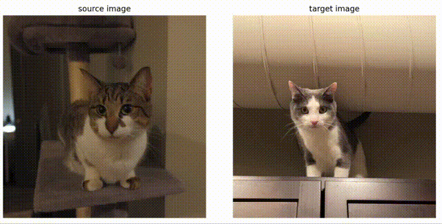
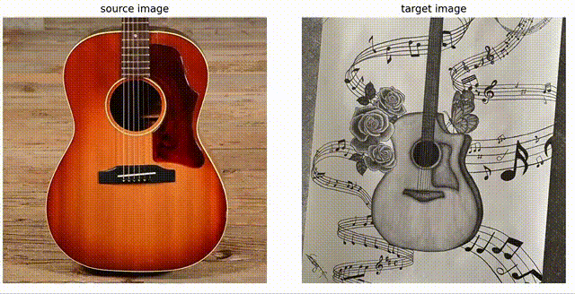

# Diffusion Features (DIFT)
This repository contains code for our NeurIPS 2023 paper "Emergent Correspondence from Image Diffusion".

### [Project Page](https://diffusionfeatures.github.io/) | [Paper](https://arxiv.org/abs/2306.03881) | [Colab Demo](https://colab.research.google.com/drive/1km6MGafhAvbPOouD3oo64aUXgLlWM6L1?usp=sharing)


## Prerequisites
If you have a Linux machine, you could either set up the python environment using the following command:
```
conda env create -f environment.yml
conda activate dift
```
or create a new conda environment and install the packages manually using the
shell commands in [setup_env.sh](setup_env.sh).

## Interactive Demo: Give it a Try!
We provide an interactive jupyter notebook [demo.ipynb](demo.ipynb) to demonstrate the semantic correspondence established by DIFT, and you could try on your own images! After loading two images, you could left-click on an interesting point of the source image on the left, then after 1 or 2 seconds, the corresponding point on the target image will be displayed as a red point on the right, together with a heatmap showing the per-pixel cosine distance calculated using DIFT. Here're two examples on cat and guitar:

<table>
    <tr>
        <td></td>
        <td></td>
    </tr>
</table>

If you don't have a local GPU, you can also use the provided [Colab Demo](https://colab.research.google.com/drive/1km6MGafhAvbPOouD3oo64aUXgLlWM6L1?usp=sharing).

## Extract DIFT for a given image
You could use the following [command](extract_dift.sh) to extract DIFT from a given image, and save it as a torch tensor. These arguments are set to the same as in the semantic correspondence tasks by default.
```
python extract_dift.py \
    --input_path ./assets/cat.png \
    --output_path dift_cat.pt \
    --img_size 768 768 \
    --t 261 \
    --up_ft_index 1 \
    --prompt 'a photo of a cat' \
    --ensemble_size 8
```
Here're the explanation for each argument:
- `input_path`: path to the input image file.
- `output_path`: path to save the output features as torch tensor.
- `img_size`: the width and height of the resized image before fed into diffusion model. If set to 0, then no resize operation would be performed thus it will stick to the original image size. It is set to [768, 768] by default. You can decrease this if encountering memory issue.
- `t`: time step for diffusion, choose from range [0, 1000], must be an integer. `t=261` by default for semantic correspondence.
- `up_ft_index`: the index of the U-Net upsampling block to extract the feature map, choose from [0, 1, 2, 3]. `up_ft_index=1` by default for semantic correspondence.
- `prompt`: the prompt used in the diffusion model.
- `ensemble_size`: the number of repeated images in each batch used to get features. `ensemble_size=8` by default. You can reduce this value if encountering memory issue.

The output DIFT tensor spatial size is determined by both `img_size` and `up_ft_index`. If `up_ft_index=0`, the output size would be 1/32 of `img_size`; if `up_ft_index=1`, it would be 1/16; if `up_ft_index=2 or 3`, it would be 1/8.

## Application: Edit Propagation
Using DIFT, we can propagate edits in one image to others that share semantic correspondences, even cross categories and domains:

More implementation details are in this notebook [edit_propagation.ipynb](edit_propagation.ipynb).

## Get Benchmark Evaluation Results
First, run the following scripts to enable the usage of DIFT_adm:
```
git clone git@github.com:openai/guided-diffusion.git
cd guided-diffusion && mkdir models && cd models
wget https://openaipublic.blob.core.windows.net/diffusion/jul-2021/256x256_diffusion_uncond.pt
```

### SPair-71k

First, download SPair-71k data:
```
wget https://cvlab.postech.ac.kr/research/SPair-71k/data/SPair-71k.tar.gz
tar -xzvf SPair-71k.tar.gz
```
Run the following script to get PCK (both per point and per img) of DIFT_sd on SPair-71k:
```
python eval_spair.py \
    --dataset_path ./SPair-71k \
    --save_path ./spair_ft \ # a path to save features
    --dift_model sd \
    --img_size 768 768 \
    --t 261 \
    --up_ft_index 1 \
    --ensemble_size 8
```
Run the following script to get PCK (both per point and per img) of DIFT_adm on SPair-71k:
```
python eval_spair.py \
    --dataset_path ./SPair-71k \
    --save_path ./spair_ft \ # a path to save features
    --dift_model adm \
    --img_size 512 512 \
    --t 101 \
    --up_ft_index 4 \
    --ensemble_size 8
```

### HPatches

First, prepare HPatches data:
```
cd $HOME
git clone git@github.com:mihaidusmanu/d2-net.git && cd d2-net/hpatches_sequences/
chmod u+x download.sh
./download.sh
```

Then, download the 1k superpoint keypoints:
```
wget "https://www.dropbox.com/scl/fi/1mxy3oycnz7m2acd92u2x/superpoint-1k.zip?rlkey=fic30gr2tlth3cmsyyywcg385&dl=1" -O superpoint-1k.zip
unzip superpoint-1k.zip
rm superpoint-1k.zip
```

Run the following script to get hompography estimation accuracy of DIFT_sd on HPatches:
```
python eval_hpatches.py \
    --hpatches_path ../d2-net/hpatches_sequences/hpatches-sequences-release \
    --kpts_path ./superpoint-1k \
    --save_path ./hpatches_results \
    --dift_model sd \
    --img_size 768 768 \
    --t 0 \
    --up_ft_index 2 \
    --ensemble_size 8

python eval_homography.py \
    --hpatches_path ../d2-net/hpatches_sequences/hpatches-sequences-release \
    --save_path ./hpatches_results \
    --hpatches_path
    --feat dift_sd \
    --metric cosine \
    --mode lmeds
```

Run the following script to get hompography estimation accuracy of DIFT_adm on HPatches:
```
python eval_hpatches.py \
    --hpatches_path ../d2-net/hpatches_sequences/hpatches-sequences-release \
    --kpts_path ./superpoint-1k \
    --save_path ./hpatches_results \
    --dift_model adm \
    --img_size 768 768 \
    --t 41 \
    --up_ft_index 11 \
    --ensemble_size 4

python eval_homography.py \
    --hpatches_path ../d2-net/hpatches_sequences/hpatches-sequences-release \
    --save_path ./hpatches_results \
    --hpatches_path
    --feat dift_adm \
    --metric l2 \
    --mode ransac
```

### DAVIS

We follow the evaluation protocal as in DINO's [implementation](https://github.com/facebookresearch/dino#evaluation-davis-2017-video-object-segmentation).

First, prepare DAVIS 2017 data and evaluation tools:
```
cd $HOME
git clone https://github.com/davisvideochallenge/davis-2017 && cd davis-2017
./data/get_davis.sh
cd $HOME
git clone https://github.com/davisvideochallenge/davis2017-evaluation
```

Then, get segmentation results using DIFT_sd:
```
python eval_davis.py \
    --dift_model sd \
    --t 51 \
    --up_ft_index 2 \
    --temperature 0.2 \
    --topk 15 \
    --n_last_frames 28 \
    --ensemble_size 8 \
    --size_mask_neighborhood 15 \
    --data_path $HOME/davis-2017/DAVIS/ \
    --output_dir ./davis_results_sd/
```

and results using DIFT_adm:
```
python eval_davis.py \
    --dift_model adm \
    --t 51 \
    --up_ft_index 7 \
    --temperature 0.1 \
    --topk 10 \
    --n_last_frames 28 \
    --ensemble_size 4 \
    --size_mask_neighborhood 15 \
    --data_path $HOME/davis-2017/DAVIS/ \
    --output_dir ./davis_results_adm/
```

Finally, evaluate the results:
```
python $HOME/davis2017-evaluation/evaluation_method.py \
    --task semi-supervised \
    --results_path ./davis_results_sd/ \
    --davis_path $HOME/davis-2017/DAVIS/

python $HOME/davis2017-evaluation/evaluation_method.py \
    --task semi-supervised \
    --results_path ./davis_results_adm/ \
    --davis_path $HOME/davis-2017/DAVIS/
```

# Misc.
If you find our code or paper useful to your research work, please consider citing our work using the following bibtex:
```
@inproceedings{
    tang2023emergent,
    title={Emergent Correspondence from Image Diffusion},
    author={Luming Tang and Menglin Jia and Qianqian Wang and Cheng Perng Phoo and Bharath Hariharan},
    booktitle={Thirty-seventh Conference on Neural Information Processing Systems},
    year={2023},
    url={https://openreview.net/forum?id=ypOiXjdfnU}
}
```
